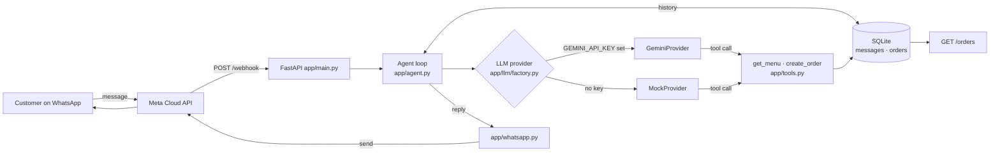

[](https://github.com/thealpdev/whatsapp-ai-order-bot/actions/workflows/ci.yml)

# WhatsApp AI Order Bot

A small WhatsApp ordering assistant for local businesses. A customer messages the
business on WhatsApp, an LLM chats back in Turkish, looks up the menu and books the
order — and the order lands in SQLite where the owner can see it.

The demo business is **Demo Pide** (`app/menu.json`): kıymalı pide 180 ₺, kaşarlı pide
170 ₺, lahmacun 90 ₺, ayran 30 ₺. Swap that one file for a different business.

It runs with **no API key at all**: a rule-based `MockProvider` takes over, so you can
try the whole flow — and run the whole test suite — completely offline.

---

## Architecture



The same agent loop backs the terminal client, so `python chat.py` exercises exactly
the code path WhatsApp does — only the transport differs.

```
app/
  main.py       FastAPI: GET/POST /webhook, GET /orders, GET /health
  agent.py      history -> provider -> tool calls -> reply (max 5 tool steps)
  tools.py      get_menu() and create_order(items, address, phone) + JSON schemas
  prompts.py    Turkish system prompt
  db.py         SQLite: messages (per phone number) and orders
  menu.py       menu loading + Turkish-insensitive item matching
  whatsapp.py   Cloud API send + X-Hub-Signature-256 verification
  llm/
    base.py     the whole provider contract: ToolSpec, ToolCall, Turn, LLMProvider
    gemini.py   google-genai, manual function calling
    mock.py     rule-based fallback, never touches the network
    factory.py  key present -> Gemini, otherwise Mock
chat.py         terminal REPL
```

**Swapping the LLM.** Everything above `app/llm/` speaks only in `StoredMessage`,
`ToolSpec`, `ToolCall` and `Turn`. Adding Claude or OpenAI means writing one
`app/llm/claude.py` with a `generate()` method and adding a branch in `factory.py` —
no other file changes.

---

## Setup

Requires Python 3.12+.

```bash
git clone https://github.com/thealpdev/whatsapp-ai-order-bot.git
cd whatsapp-ai-order-bot
python -m venv .venv && source .venv/bin/activate
pip install -e ".[dev]"
cp .env.example .env
```

### Try it without any keys

```bash
python chat.py
```

### With Gemini

Get a free key at [aistudio.google.com/apikey](https://aistudio.google.com/apikey), put
it in `.env` as `GEMINI_API_KEY`, and run `python chat.py` again — it switches provider
automatically. `GEMINI_MODEL` defaults to `gemini-2.5-flash`; any Flash-family model on
the free tier works.

### Run the API

```bash
uvicorn app.main:app --reload
curl localhost:8000/orders
```

### Connect WhatsApp

1. Create a Meta app with the **WhatsApp** product and note the phone number ID,
   access token and app secret.
2. Fill `WA_*` in `.env`. `WA_VERIFY_TOKEN` is any random string you pick.
3. Expose the app (`ngrok http 8000`) and register `https://<host>/webhook` as the
   callback URL with that same verify token, subscribed to `messages`.

Meta retries anything slower than ~20 s, so the webhook answers immediately and the
LLM call runs in a background task.

### Docker

```bash
docker build -t whatsapp-ai-order-bot .
docker run -p 8000:8000 --env-file .env -v $(pwd)/data:/data whatsapp-ai-order-bot
```

---

## Example conversation (mock mode, no API key)

```
$ python chat.py +905551112233
Demo Pide sipariş botu — provider: mock, müşteri: +905551112233
(GEMINI_API_KEY yok, kural tabanlı mock modda çalışıyor.)
Çıkmak için 'q'.

sen > merhaba
bot > Merhaba, Demo Pide'ye hoş geldin! Menüyü göndereyim mi?

sen > menüde ne var?
bot > Menümüz şöyle:
- Kıymalı Pide — 180 TL
- Kaşarlı Pide — 170 TL
- Lahmacun — 90 TL
- Ayran — 30 TL
Ne alırsın?

sen > 2 lahmacun 1 ayran alayım
bot > Sepetin: 2 lahmacun, 1 ayran. Teslimat adresini yazar mısın?

sen > Kızılay Mah. 7. Cadde No:12 Daire 3, Çankaya
bot > Siparişin alındı! Sipariş no #1, toplam 210 TL. 30-40 dk içinde kapında.
```

```console
$ curl -s localhost:8000/orders | jq
{
  "orders": [
    {
      "id": 1,
      "phone": "+905551112233",
      "address": "Kızılay Mah. 7. Cadde No:12 Daire 3, Çankaya",
      "items": [
        { "name": "Lahmacun", "qty": 2, "price": 90, "line_total": 180 },
        { "name": "Ayran", "qty": 1, "price": 30, "line_total": 30 }
      ],
      "total": 210.0,
      "status": "received",
      "created_at": "2026-09-08T12:36:23+00:00"
    }
  ]
}
```

### Screenshot

<!-- Drop a real WhatsApp screenshot here: docs/screenshot.png -->


---

## Tests

```bash
pytest
ruff check . && ruff format --check .
```

Tests always use `MockProvider` against a temporary SQLite file — no network calls, no
API key needed. CI runs the same two commands on every push.

## Notes

- The bot never invents prices; menu questions always go through the `get_menu` tool.
- `create_order` validates every item against the menu and refuses partial orders, so a
  hallucinated product or a missing address can't become a real order.
- Conversation history is stored per phone number and the last 20 messages are replayed
  on each turn (`HISTORY_LIMIT`).

## License

MIT
